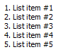
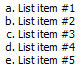
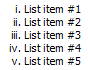
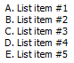
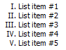
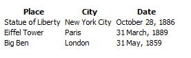

# TSFormatter

Helper package to format TeamSpeak BBCode

## 📦 Installation

```shell
pip install tsformatter
```

## ✏️ Usage

importing the formatter

```python
import tsformatter
```

### Colors

```python
# Using HTML color name
>>> tsformatter.color("red", "This text is red")
'[COLOR=red]This text is red[/COLOR]'

>>> tsformatter.color("PaleTurquoise", "This text is turquoise")
'[COLOR=PaleTurquoise]This text is turquoise[/COLOR]'


# Using Hex Triplet
>>> tsformatter.color("#f00", "This text is red")
'[COLOR=f00]This text is red[/COLOR]'

>>> tsformatter.color("#AFEEEE", "This text is turquoise")
'[COLOR=#AFEEEE]This text is turquoise[/COLOR]'
```

### Horizontal line

```python
>>> tsformatter.hr
'[HR]'
```

### Images

```python
>>> tsformatter.img("https://i.imgur.com/ml09ccU.png")
'[IMG]https://i.imgur.com/ml09ccU.png[/IMG]'
```

### Links

```python
# Without specifying link text
>>> tsformatter.link("https://www.teamspeak.com/")
'[URL]https://www.teamspeak.com/[/URL]'

# With a link text
>>> tsformatter.link("https://www.teamspeak.com/", "TeamSpeak Website")
'[URL=https://www.teamspeak.com/]TeamSpeak Website[/URL]'
```

### Lists

```python
# Default style of the list is bullet list
>>> tsformatter.list_(f"List item #{x}" for x in range(1, 6))
'[LIST]\n[*]List item #1\n[*]List item #2\n[*]List item #3\n[*]List item #4\n[*]List item #5\n[/LIST]'


# You can specify the style of the list
>>> tsformatter.list_((f"List item #{x}" for x in range(1, 6)), style="1")
'[LIST=1]\n[*]List item #1\n[*]List item #2\n[*]List item #3\n[*]List item #4\n[*]List item #5\n[/LIST]'
```

#### List styles that work:

| Style   |                    "1"                    |                       "a"                        |                      "i"                      |                      "A"                      |                      "I"                      |
| ------- | :---------------------------------------: | :----------------------------------------------: | :-------------------------------------------: | :-------------------------------------------: | :-------------------------------------------: |
| Renders |  |  |  |  |  |

### Placement

```python
>>> tsformatter.left("Formatted to the left")
'[LEFT]Formatted to the left[/LEFT]'

>>> tsformatter.right("Formatted to the right")
'[RIGHT]Formatted to the right[/RIGHT]'

>>> tsformatter.center("Center of the space")
'[CENTER]Center of the space[/CENTER]'
```

### Size

```python
# Using absolute sizes
>>> tsformatter.size(24, "I am huge!")
'[SIZE=24]I am huge![/SIZE]'

# Relative sizes can be either positive or negative
>>> tsformatter.size('-4', "I am 4 units smaller than the rest")
'[SIZE=-2]I am 2 units smaller than the rest[/SIZE]'

>>> tsformatter.size('+2', "I am 2 units bigger than the rest")
'[SIZE=+2]I am 2 units bigger than the rest[/SIZE]'
```

### Styles

```python
>>> tsformatter.bold("Example text")
'[B]Example text[/B]'

>>> tsformatter.italic("Example text")
'[I]Example text[/I]'

>>> tsformatter.underline("Example text")
'[U]Example text[/U]'

>>> tsformatter.strike("Example text")
'[S]Example text[/S]'
```

### Tables

```python

>>> header = ("Place", "City", "Date")
>>> data1 = ("Statue of Liberty", "New York City", "October 28, 1886")
>>> data2 = ("Eiffel Tower", "Paris", "31 March, 1889")
>>> data3 = ("Big Ben", "London", "31 May, 1859")

>>> tsformatter.table(
        tsformatter.table_header_row(header),
        tsformatter.table_row(data1),
        tsformatter.table_row(data2),
        tsformatter.table_row(data3)
    )
'[TABLE]\n[TR][TH]Place[/TH][TH]City[/TH][TH]Date[/TH][/TR]\n[TR][TD]Statue of Liberty[/TD][TD]New York City[/TD][TD]October 28, 1886[/TD][/TR]\n[TR][TD]Eiffel Tower[/TD][TD]Paris[/TD][TD]31 March, 1889[/TD][/TR]\n[TR][TD]Big Ben[/TD][TD]London[/TD][TD]31 May, 1859[/TD][/TR]\n[/TABLE]'
```

#### Results when rendered by TeamSpeak client:


